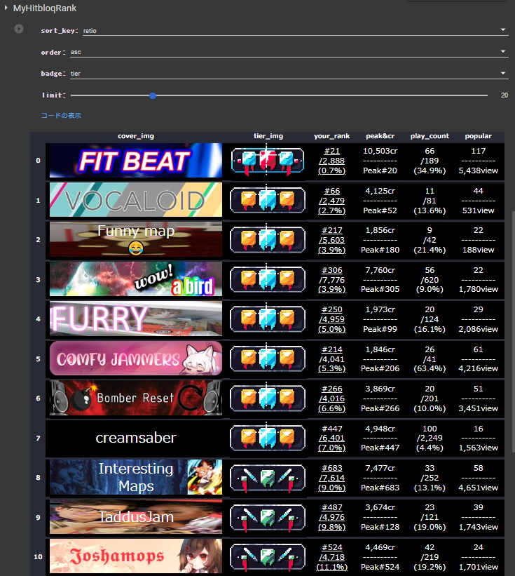

# MyHitbloqRank

[English](README.md)

[Hitbloq](https://hitbloq.com/)の各map poolの自分のランキングデータを取得し、一覧で閲覧できる[Google Colab Notebook](https://colab.research.google.com/github/hatopopvr/MyHitbloqRank/blob/main/MyHitbloqRank_En.ipynb)です. 

## Data
- Ranking Data from HitBloq API - [GitHub](https://github.com/DaFluffyPotato/hitbloq/blob/main/main.py)
- Ranked Map Count scraped from HitBloq Web Site - https://hitbloq.com/map_pool/{pool}

## how to use

1. [notebook](https://colab.research.google.com/github/hatopopvr/MyHitbloqRank/blob/main/MyHitbloqRank_En.ipynb) を開き、以下の情報を入力します。
 - `player_id` : ScoreSaberのPlayerIDを入力してください。(HitbloqのUserIDではないので注意)
 
2. `ランタイム`タブを選択し、 `すべてのセルを実行`か `再起動してすべてのセルを実行` を選択し、実行してください。
　Google DriveにHitbloqのID情報等を保存するため、認証を行ってください．

3. 初回のみ、HitBloqのUserID(4桁)が要求されますの入力して下さい．(以後はScoreSaberのPlayerIDに紐づけてUserIDを保存するので,ScoreSabarのIDから自動的に取得されます.)

4. ScoreSaberのユーザ名とHitbloqのユーザ名が一致している場合、ランキング取得処理が実行され、結果一覧が表示されます。

## Author
- hatopop ([@hatopop_vr](https://twitter.com/hatopop_vr))
